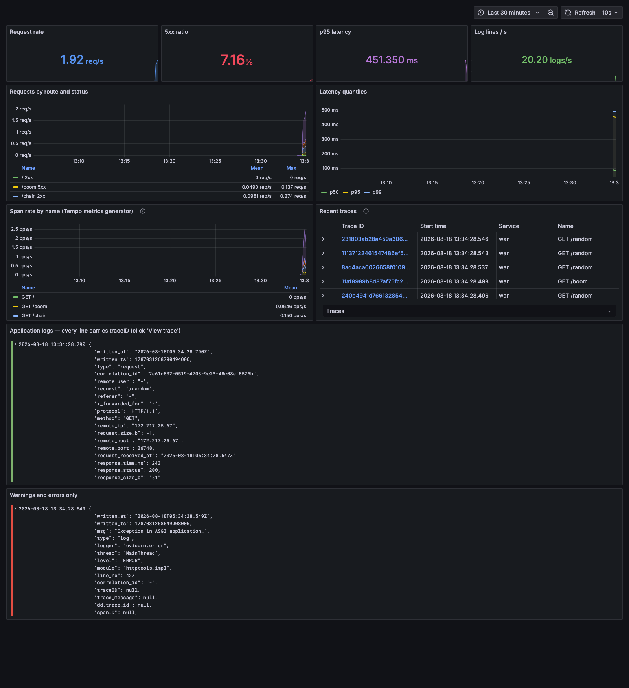
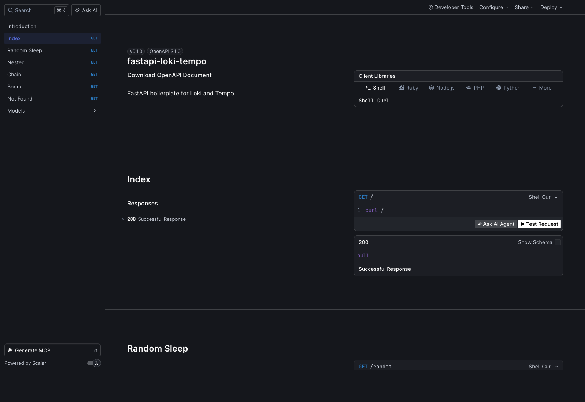

# fastapi-loki-tempo

FastAPI boilerplate for Loki and Tempo.

Loki and Tempo are a very useful open source stack to combine logging + tracing. One
call wires up both, plus metrics, health probes and API docs:

```python
import fastapi_loki_tempo
from fastapi import FastAPI

app = FastAPI()
fastapi_loki_tempo.patch(app=app)
```



## What is this?

1. Every log from the `logging` module becomes one line of JSON containing the active
   trace id, so a log line can be traced back to the request that produced it:

```json
{"written_at": "2023-10-01T15:16:27.952Z", "written_ts": 1696173387952311000, "msg": "I sleep for 0.23938469734819534 seconds", "type": "log", "logger": "root", "thread": "MainThread", "level": "INFO", "module": "app", "line_no": 23, "correlation_id": "7e2b2e38-606d-11ee-80fc-6905893e1fcd", "traceID": "2a8642fab4a4c6e22224ca24e8815670", "trace_message": "traceID=2a8642fab4a4c6e22224ca24e8815670", "dd.trace_id": "2460313556319557232"}
```

2. Every HTTP request produces a `type=request` line with the same trace id:

```json
{"written_at": "2023-10-01T15:16:28.192Z", "written_ts": 1696173388192492000, "type": "request", "correlation_id": "7e2b2e38-606d-11ee-80fc-6905893e1fcd", "remote_user": "-", "request": "/random", "referer": "http://localhost:7072/docs", "x_forwarded_for": "-", "protocol": "HTTP/1.1", "method": "GET", "remote_ip": "127.0.0.1", "request_size_b": -1, "remote_host": "127.0.0.1", "remote_port": 59378, "request_received_at": "2023-10-01T15:16:27.951Z", "response_time_ms": 240, "response_status": 200, "response_size_b": "51", "response_content_type": "application/json", "response_sent_at": "2023-10-01T15:16:28.192Z", "traceID": "2a8642fab4a4c6e22224ca24e8815670", "trace_message": "traceID=2a8642fab4a4c6e22224ca24e8815670", "dd.trace_id": "2460313556319557232"}
```

3. `trace_message` carries the `traceID=` form Loki's derived fields match on, so
   Grafana can link Loki straight to Tempo — and Tempo straight back to Loki.

Both shapes above are the exact schema `json_logging` produced, so existing Loki
queries, dashboards and alerts keep working. Additional fields are appended after
them: `spanID`, `service`, `service_version`, `environment`, `level` (on request lines
too) and `request_route`.

## Installation

```bash
pip3 install git+https://github.com/Scicom-AI-Enterprise-Organization/fastapi-loki-tempo
```

## How to

Simple as,

```python
import fastapi_loki_tempo
from fastapi import Request, FastAPI

app = FastAPI()
fastapi_loki_tempo.patch(app=app)
```

`patch` then gives the app:

| | |
|---|---|
| JSON logs | trace id, span id and correlation id on every line |
| Request logs | one `type=request` line per request, with timing and status |
| Tracing | OpenTelemetry spans exported to Tempo over OTLP |
| Metrics | Prometheus at `/metrics` |
| Health | `/healthz`, `/livez`, `/readyz`, excluded from traces and request logs |
| API docs | Scalar at `/scalar` |
| Headers | `X-Correlation-ID` and `X-Trace-Id` on every response |

Every argument defaults to an environment variable, so the same image runs
unchanged in local, staging and production.

```python
def patch(
    app,
    service_name: str = SERVICE_NAME,
    otlp_endpoint: Optional[str] = OTLP_ENDPOINT,
    jaeger_host: Optional[str] = JAEGER_HOST,
    jaeger_port: Optional[int] = JAEGER_PORT,
    tracing_sample: float = TRACING_SAMPLE,
    enable_prometheus_metrics: bool = ENABLE_PROMETHEUS_METRICS,
    enable_scalar_doc: bool = ENABLE_SCALAR_DOC,
    scalar_doc_endpoint: str = SCALAR_DOC_ENDPOINT,
    # ... see fastapi_loki_tempo/os_env.py for the full list
)
```

Run FastAPI,

```bash
uvicorn app:app --reload --host 0.0.0.0 --port 7072
```

### Configuration

| Environment variable | Default | Purpose |
|---|---|---|
| `SERVICE_NAME` | `fastapi` | `service.name` on spans, `service` on logs |
| `SERVICE_VERSION` | – | `service.version` on spans |
| `DEPLOYMENT_ENVIRONMENT` | – | `deployment.environment` on spans |
| `OTLP_ENDPOINT` | – | Tempo OTLP endpoint. Unset: trace ids are still logged, nothing is exported |
| `OTLP_PROTOCOL` | `grpc` | `grpc` (port 4317) or `http` (port 4318) |
| `OTLP_HEADERS` | – | `key=value,key=value`, e.g. Grafana Cloud auth |
| `OTLP_INSECURE` | `true` | Skip TLS for the gRPC exporter |
| `TRACING_SAMPLE` | `1.0` | Head sampling ratio in (0, 1], via a ParentBased sampler |
| `SPAN_EXPORT_DELAY_MS` | `2000` | Batch export interval |
| `ENABLE_CONSOLE_SPAN_EXPORTER` | `false` | Print spans to stdout, for debugging without a backend |
| `TRACE_EXCLUDE_URLS` | `healthz,livez,readyz,metrics,favicon.ico` | Regexes that must not create spans |
| `LOGLEVEL` | `INFO` | Root log level |
| `LOG_STDOUT` | `true` | Write JSON logs to stdout |
| `LOG_FILE` | – | Also write to this rotating file, for file-tailing agents |
| `LOG_MAX_MSG_LENGTH` | `0` | Truncate `msg` above this length (0 = never) |
| `ENABLE_REQUEST_LOG` | `true` | Emit `type=request` lines |
| `LOG_EXCLUDE_URLS` | `/healthz,/livez,/readyz,/metrics` | Path prefixes not to request-log |
| `CORRELATION_ID_HEADERS` | `x-correlation-id,correlation-id,x-request-id,request-id` | Inbound headers to reuse as the correlation id |
| `CORRELATION_ID_HEADER` | `X-Correlation-ID` | Header written on responses and on outbound calls |
| `ENABLE_CORRELATION_ID_PROPAGATION` | `true` | Forward the correlation id on outbound calls |
| `ENABLE_PROMETHEUS_METRICS` | `true` | Expose `/metrics` |
| `METRICS_ENDPOINT` | `/metrics` | Where |
| `ENABLE_HEALTH_ENDPOINTS` | `true` | Add `/healthz`, `/livez`, `/readyz` |
| `ENABLE_SCALAR_DOC` | `true` | Serve the Scalar reference |
| `SCALAR_DOC_ENDPOINT` | `/scalar` | Where |
| `SCALAR_THEME` | `purple` | Scalar theme name |
| `SCALAR_DARK_MODE` | `true` | Dark mode |
| `SCALAR_JS_URL` | pinned CDN | Point at a self hosted bundle for air-gapped deploys |
| `ENABLE_HTTPX_INSTRUMENTATION` | `false` | Trace outbound `httpx` calls (needs the `httpx` extra) |
| `ENABLE_REQUESTS_INSTRUMENTATION` | `false` | Trace outbound `requests` calls (needs the `requests` extra) |
| `JAEGER_HOST` / `JAEGER_PORT` | – / `6831` | Deprecated, see below |

### Correlation ids across services

One id for one logical request, however many services it touches. Both directions are
automatic.

**Inbound.** If the caller already sent a correlation id, it is reused rather than
regenerated. Any header in `CORRELATION_ID_HEADERS` is accepted, checked in order, so
services that call it `X-Request-ID` work without config:

```bash
curl localhost:7072/random -H 'X-Correlation-ID: id-from-service-a'
# every log line for this request logs correlation_id=id-from-service-a
# and the response echoes back X-Correlation-ID: id-from-service-a
```

Only when no header is present is a fresh uuid4 minted.

**Outbound.** The id is attached to calls this service makes, so the next service
receives it and reuses it. An outgoing request starts with empty headers — it does not
inherit the inbound ones — so this is a real step, not a no-op:

```python
# no headers passed by hand; the id rides along next to `traceparent`
async with httpx.AsyncClient() as client:
    await client.get('http://service-b/work')
```

That works through an OpenTelemetry `TextMapPropagator`
(`fastapi_loki_tempo/propagation.py`) composed onto the global propagator, which is what
every OpenTelemetry HTTP instrumentation injects into its outbound headers. So it covers
httpx, requests, aiohttp, urllib and grpc alike instead of needing an integration per
client library. The value is read from the request context at the moment of the call, so
it is always the current request's id.

**It requires the client to be instrumented.** Set `ENABLE_HTTPX_INSTRUMENTATION=true`
or `ENABLE_REQUESTS_INSTRUMENTATION=true` (the `httpx` / `requests` extras). For a client
that is not instrumented, pass the header yourself:

```python
async with httpx.AsyncClient(headers=fastapi_loki_tempo.correlation_headers()) as client:
    ...
```

Reading the current ids anywhere in a request:

```python
trace_id, span_id, dd_trace_id = fastapi_loki_tempo.get_trace_ids()
correlation_id = fastapi_loki_tempo.get_correlation_id()
```

Then in Loki, one id gives you every service's logs for that request:

```logql
{job=~"fastapi|service-b"} | correlation_id="id-from-service-a"
```

### Correlation id vs trace id

They answer different questions and both are on every line:

| | Set by | Survives hops via | Use it for |
|---|---|---|---|
| `traceID` | OpenTelemetry | `traceparent` (W3C standard) | jumping to the trace in Tempo; span timings |
| `correlation_id` | this library | `X-Correlation-ID` | grepping logs, and giving the id to a customer in an error response |

A trace id only exists while tracing is on and is dropped by sampling; a correlation id
is always present and is safe to show a user or put in a support ticket.

## Example



The `grafana/` directory is a complete working stack: the app, Tempo, Loki, Alloy,
Prometheus and Grafana, with datasources and a dashboard already provisioned.

1. Run the whole thing,

```bash
docker compose -f grafana/docker-compose.yaml up -d --build
```

| Service | URL |
|---|---|
| App | http://localhost:7072 |
| Scalar docs | http://localhost:7072/scalar |
| Grafana | http://localhost:3010/d/fastapi-loki-tempo |
| Loki | http://localhost:3110 |
| Tempo | http://localhost:3210 |
| Prometheus | http://localhost:9092 |
| Alloy | http://localhost:12345 |

Ports live in `grafana/.env`. They are shifted off the canonical
3000/3100/3200/4317/9090 so this stack can run next to another Grafana stack on the
same machine; delete that file to use the defaults.

2. Request the API,

```bash
curl -X 'GET' \
  'http://localhost:7072/random?minimum=0.1&maximum=2' \
  -H 'accept: application/json'
```

3. Open Grafana, and follow the trace id in either direction:

- **Loki → Tempo.** Explore → Loki → `{job="fastapi"}`. Expand any line and click
  **View trace**. That link comes from a derived field matching `traceID=(\w+)` in the
  raw line.
- **Tempo → Loki.** Open a trace, select a span, click **Logs for this span**. That
  runs `{job="fastapi"} |= "<traceId>"` against Loki.

### Running the app on the host instead

The stack also tails `grafana/logs/*.log`, so an app run outside docker still lands in
Loki:

```bash
docker compose -f grafana/docker-compose.yaml up -d tempo loki alloy prometheus grafana

OTLP_ENDPOINT=http://localhost:4327 \
LOG_FILE=grafana/logs/app.log \
uvicorn app:app --reload --host 0.0.0.0 --port 7072
```

### Two services sharing one correlation id

`app` calls itself, which shows propagation but keeps a single `service.name`. The
`two-services` profile runs two genuinely separate services, both exporting to the same
Tempo and both shipping logs to the same Loki:

```bash
docker compose -f grafana/docker-compose.yaml --profile two-services up -d --build
python3 scripts/two_services.py
```

It calls `service-a` with a correlation id, as a gateway or upstream service would, and
asserts the id is reused by A, forwarded to B, and that one trace covers both:

```
A -> B response: {"service": "service-a", "depth": 1, "downstream": {"service": "service-b", "message": "leaf"}}

PASS  A actually called B                                    service-a -> service-b
PASS  A reused the caller-supplied correlation id            A echoed back sim-from-caller-...
PASS  one correlation_id filter returns both services' logs  ['service-a', 'service-b'] on 1 trace
PASS  each service is independently queryable in Loki        service-a=3 lines, service-b=2 lines
PASS  Tempo holds one trace covering both services           7 spans across ['service-a', 'service-b']
PASS  the logged traceID is the one Tempo indexed            5 log lines carry traceID=...
PASS  Tempo service graph shows the A -> B edge              1 series for service-a -> service-b
```

The resulting log lines, from two different containers, one correlation id and one
trace id:

```
service=service-a  type=log      correlation_id=sim-from-caller-...  traceID=7a15c7cc..  spanID=2e41f7133b0d528a
  chain depth=1 on service-a
service=service-a  type=log      correlation_id=sim-from-caller-...  traceID=7a15c7cc..  spanID=2e41f7133b0d528a
  HTTP Request: GET http://service-b:8000/chain?depth=0 "HTTP/1.1 200 OK"
service=service-a  type=request  correlation_id=sim-from-caller-...  traceID=7a15c7cc..  spanID=2e41f7133b0d528a
  GET /chain -> 200
service=service-b  type=log      correlation_id=sim-from-caller-...  traceID=7a15c7cc..  spanID=a0af0b131e94f8ad
  chain depth=0 on service-b
service=service-b  type=request  correlation_id=sim-from-caller-...  traceID=7a15c7cc..  spanID=a0af0b131e94f8ad
  GET /chain -> 200
```

Same `traceID`, same `correlation_id`, different `spanID` per service. In Grafana:

```logql
{job="fastapi"} | correlation_id="<the id>"      # both services' logs
{service="service-b"} | correlation_id="<the id>" # just B's
```

Tempo's service graph gains a real edge, visible under the Tempo datasource's
**Service Graph** tab:

```
user       -> service-a   count=1
service-a  -> service-b   count=1
```

Point a service at any other instance with `DOWNSTREAM_URL` to extend the chain.

### Deep links into Grafana

`two_services.py` prints ready-to-open Grafana links when it finishes. For any other
trace, generate them:

```bash
python3 scripts/links.py                                  # newest trace in Tempo
python3 scripts/links.py --trace 7408a823301db5736ca02a4c2f163630
python3 scripts/links.py --correlation sim-from-caller-1786967724
python3 scripts/links.py --service service-a
```

It prints six links: the trace in Tempo, its logs in Loki, **both side by side in one
Explore view**, a TraceQL search, the service graph, and the dashboard.

Grafana's Explore state is a JSON blob in the query string, so these are generated
rather than hand written — the shape is `?schemaVersion=1&orgId=1&panes={...}`, with one
entry per pane:

```python
panes = {
  "lg": {"datasource": "loki",  "queries": [{"expr": '{job="fastapi"} | correlation_id="..."'}], ...},
  "tr": {"datasource": "tempo", "queries": [{"queryType": "traceql", "query": "<traceID>"}], ...},
}
```

Two keys in `panes` is what gives you logs and the flame graph in one screen, which is
usually what you want when debugging a cross-service request.

`scripts/links.py` is importable if you want the URLs elsewhere:

```python
from links import explore_url, loki_pane, tempo_pane

explore_url({'lg': loki_pane('{job="fastapi"}'), 'tr': tempo_pane(trace_id)})
```

### Verifying it actually works

```bash
python3 scripts/e2e.py
```

Standard library only, no dependencies. It generates traffic and then asserts the
whole chain: that every log line is valid JSON with a well formed trace id, that the
trace id from a log line resolves in Tempo, that the same id finds those logs back in
Loki, that Scalar serves and its bundle is pinned and reachable, that Prometheus
scrapes the app and receives Tempo's generated span metrics, and that Grafana can run
each dashboard query through its own datasource proxy. 38 checks.

```
== loki (logs) ==
PASS  app logs reach Loki                                    46 entries under {job="fastapi"}
PASS  Tempo -> Loki: trace id finds its log lines            (Tempo -> Loki link)
PASS  Loki -> Tempo: derived field regex matches the raw line 48 lines match traceID=(\w+)
PASS  traceID is structured metadata, not a label            traceID is not a label
...
all 38 checks passed
```

Unit tests:

```bash
pip install -e '.[dev]'
pytest
```

## How the stack fits together

```
                       ┌──────────────┐
        OTLP :4317 ───▶ │    Tempo     │ ──── span metrics ──┐
       (traces)        └──────────────┘   (remote_write)     │
             ▲                                              ▼
      ┌──────┴──────┐   stdout JSON    ┌───────┐      ┌────────────┐
      │  FastAPI    │ ───────────────▶ │ Alloy │ ───▶ │ Prometheus │
      │  + patch()  │                  └───────┘      └────────────┘
      └─────────────┘                       │ push          ▲
             │ /metrics scrape              ▼               │
             └────────────────────────▶ ┌──────┐            │
                                        │ Loki │            │
                                        └──────┘            │
                                            └───── Grafana ─┘
```

Alloy reads container stdout, parses the JSON, sets low cardinality Loki labels
(`level`, `log_type`, `service`, `environment`) and attaches the high cardinality
fields (`traceID`, `spanID`, `correlation_id`, `response_status`, `request_route`) as
**structured metadata** rather than labels — filterable without multiplying streams.

## Notes

### Deprecated Jaeger exporter

`jaeger_host` / `jaeger_port` still work but the Jaeger thrift exporter was deprecated
upstream in OpenTelemetry 1.16 and is not installed by default. Tempo ingests OTLP
natively, so prefer `otlp_endpoint`. If you need it:

```bash
pip install 'fastapi-loki-tempo[jaeger]'
JAEGER_HOST=localhost JAEGER_PORT=6841 uvicorn app:app --port 7072
```

### Duplicate exception logs

An unhandled exception is logged twice: once by this library, attached to the
`type=request` line with the trace id, correlation id and traceback; and once by
uvicorn from outside the request, with `traceID: null`. The uvicorn one is deliberately
left alone — it is the only record if a failure happens outside the middleware stack.
Filter on `log_type="request"` if you only want the correlated copy.

### Sampling

`TRACING_SAMPLE` uses a `ParentBased(TraceIdRatioBased(...))` sampler, so a trace is
never sampled halfway: if an upstream service sampled it, this service keeps its spans
too, and traces never come out with holes in the middle.

### Air-gapped Scalar

The Scalar bundle is pinned to an exact version rather than `@latest`, so an upstream
release cannot break the docs page of an already deployed service. With no internet
access, download `standalone.min.js`, serve it yourself and set `SCALAR_JS_URL`; the
page shows an explicit error and a link to the raw spec if the bundle cannot load.

## What changed from the original

This is a rewrite of [huseinzol05/fastapi-loki-tempo](https://github.com/huseinzol05/fastapi-loki-tempo).
`patch()` keeps the same signature, and the log schema is unchanged, so it is a drop-in
replacement. Behaviour that was wrong or missing before:

- **Loki, Grafana and Prometheus were not in the stack at all.** `grafana/docker-compose.yaml`
  only ran Tempo and a Jaeger UI, so nothing in a repo called `fastapi-loki-tempo`
  actually shipped a log to Loki. Now Loki, Alloy, Prometheus and Grafana are all
  there, with datasources, derived fields and a dashboard provisioned.
- **Trace ids were not zero padded.** `hex(trace_id)[2:]` drops leading zeros, so
  roughly 1 in 16 trace ids was shorter than 32 characters and could not be looked up
  in Tempo. Now formatted as `032x`.
- **`tracing_sample` was accepted and ignored.** No sampler was ever built, so
  sampling was always 100%.
- **`enable_prometheus_metrics` was accepted and ignored.** `/metrics` was always
  exposed.
- **Correlation ids cost a stack walk per log line.** `json_logging` searched 11 stack
  frames on every log call looking for a local named `request`, which is slow and
  silently wrong when the frame depth changes. It is a `ContextVar` now, and
  `json_logging` (unmaintained since 2021) is no longer a dependency.
- **`request.user` was read unguarded**, raising `AssertionError` on every request
  unless Starlette's `AuthenticationMiddleware` happened to be installed.
- **Non-JSON startup logs.** uvicorn kept its own handlers, so its lines stayed plain
  text and Loki could not parse them. All loggers are rerouted now.
- **`uvicorn.access` duplicated every request** in a second, less useful format.
- Unhandled exceptions, 4xx/5xx levels, response sizes for streaming responses,
  `spanID`, `X-Trace-Id`, health endpoints, `root_path` aware docs, an unpinned Scalar
  CDN, `min`/`max` being ignored by the example `/random` handler, and the
  `__version__` / `setup.py` version mismatch.

## Development

```bash
pip install -e '.[dev]'
pytest                                                    # unit tests
docker compose -f grafana/docker-compose.yaml up -d --build
python3 scripts/e2e.py                                    # end to end
docker compose -f grafana/docker-compose.yaml down -v     # tear down
```

## License

MIT
